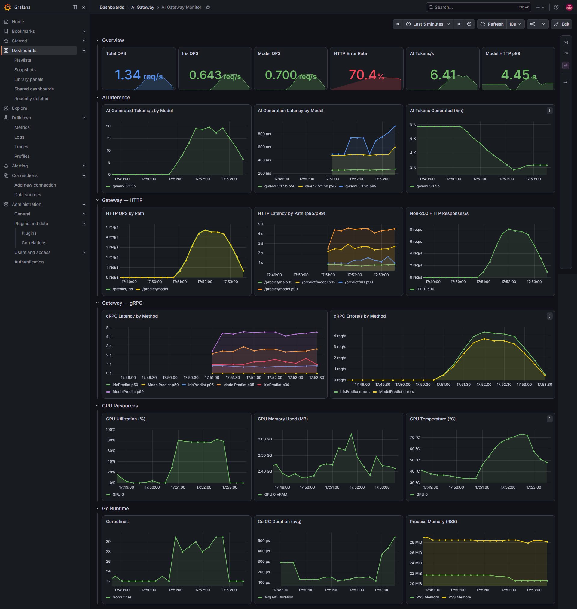

# AI Microservice Demo

A production-style AI inference platform built as a portfolio project, demonstrating modern microservice patterns: REST-to-gRPC gateway, unary + streaming LLM inference, distributed tracing, Prometheus metrics, and Kubernetes deployment.

## Architecture


```
Client (HTTP)
     │
     ▼
┌─────────────────────────────────┐
│  go-gateway  (Gin · port 8080)  │  REST API gateway
│  • /predict/iris                │  • Prometheus metrics
│  • /predict/model               │  • OpenTelemetry tracing
│  • /predict/model/stream (SSE)  │  • pprof profiling (:6060, opt-in)
│  • /healthz · /readyz · /metrics│
└────────────┬────────────────────┘
             │ gRPC (port 50051)
             ▼
┌─────────────────────────────────┐
│  python-ai  (gRPC server)       │  ML inference backend
│  • IrisPredictor (scikit-learn) │  • OpenTelemetry tracing
│  • ModelPredictor (Ollama)      │  • Structured logging
└────────────┬────────────────────┘
             │ HTTP (port 11434)
             ▼
        Ollama (Qwen2.5:1.5b)      LLM running on host / GPU

Observability stack (dual Prometheus):
  Docker Prometheus :9090  →  Grafana :3000   (dev dashboards, GPU, port-forward scrape)
  In-cluster Prometheus  →  prometheus-adapter  →  HPA (per-pod p99_latency)
  Jaeger                 :16686 (distributed traces)
Optional:
  NVIDIA GPU Exporter :9835
```

## Tech Stack

| Layer          | Technology                                          |
|----------------|-----------------------------------------------------|
| API Gateway    | Go 1.25 · Gin · gRPC client                        |
| ML Service     | Python 3.12 · scikit-learn · Ollama                |
| Communication  | Protocol Buffers v3 · gRPC                          |
| Observability  | Prometheus (Docker + in-cluster) · Grafana · Jaeger · HPA adapter |
| Container      | Docker · Docker Compose                             |
| Orchestration  | Kubernetes · HPA · ServiceMonitor                   |
| Load Testing   | k6                                                  |
| Code Gen       | Buf                                                 |

## Quick Start

### Prerequisites

- **Docker & Docker Compose** — required for both the local and Kubernetes paths
- [Ollama](https://ollama.com/) running on the host with `qwen2.5:1.5b` pulled:
  ```bash
  ollama pull qwen2.5:1.5b
  ```
- For the Kubernetes / autoscaling path also install: [`kind`](https://kind.sigs.k8s.io) (or minikube/k3s), [`kubectl`](https://kubernetes.io/docs/tasks/tools/), and [`helm`](https://helm.sh/docs/intro/install/). `deploy.sh` auto-creates a local `kind` cluster if none is reachable.

### Run locally

```bash
# Clone and start all services
git clone https://github.com/Li-PengSheng/ai-gateway-monitor.git
cd ai-gateway-monitor
docker compose up --build
```

Services will be available at:

| Service     | URL                                          |
|-------------|----------------------------------------------|
| API Gateway | http://localhost:8080                        |
| Prometheus  | http://localhost:9090                        |
| Grafana     | http://localhost:3000 (admin/admin)          |
|             | Dashboard: **AI Gateway** → **AI Gateway Monitor** (auto-imported) |
| Jaeger UI   | http://localhost:16686                       |

### API Examples

```bash
# Iris flower classification
curl -X POST http://localhost:8080/predict/iris \
  -H 'Content-Type: application/json' \
  -d '{"sepal_length":6.0,"sepal_width":3.0,"petal_length":5.5,"petal_width":2.0}'
# → {"id":2,"result":"virginica","source":"Go Gateway -> Python AI (Iris)"}

# LLM inference (Qwen2.5)
curl -X POST http://localhost:8080/predict/model \
  -H 'Content-Type: application/json' \
  -d '{"prompt":"Explain machine learning in one sentence."}'
# → {"metrics":{"duration_sec":...,"output_tokens":...,"prompt_tokens":...},"model":"qwen2.5:1.5b","reply":"...","source":"Go Gateway -> Ollama (Qwen)"}

# LLM streaming inference (Server-Sent Events)
curl -N -X POST http://localhost:8080/predict/model/stream \
  -H 'Content-Type: application/json' \
  -d '{"prompt":"Explain machine learning in one sentence."}'
# → event: message / data: {...} chunks, then event: done

# Liveness (process up, no downstream dependency)
curl http://localhost:8080/healthz
# → {"status":"ok"}

# Readiness (gRPC backend connection healthy)
curl http://localhost:8080/readyz
# → {"status":"ready","grpc_state":"READY"}
```

## Configuration

Environment variables for each service:

| Variable                  | Service              | Default              | Description                                      |
|---------------------------|----------------------|----------------------|--------------------------------------------------|
| `HTTP_ADDR`               | go-gateway           | `:8080`              | Go gateway HTTP listen address                   |
| `PPROF_ADDR`              | go-gateway           | `localhost:6060`     | pprof listen address (localhost-only by default) |
| `PPROF_ENABLED`           | go-gateway           | `false`              | Enable Go runtime profiling endpoint             |
| `AI_SERVICE_ADDR`         | go-gateway           | `localhost:50051`    | Python gRPC backend address                      |
| `JAEGER_ENDPOINT`         | go-gateway/python-ai | `localhost:4317`     | OTLP endpoint for tracing export                 |
| `LOG_LEVEL`               | go-gateway/python-ai | `info`               | Log level (`debug`, `info`, `warn`, `error`)     |
| `HTTP_READ_TIMEOUT`       | go-gateway           | `10s`                | HTTP server read timeout                         |
| `HTTP_WRITE_TIMEOUT`      | go-gateway           | `75s`                | HTTP write timeout (≥ `MODEL_TIMEOUT` + 15s)     |
| `HTTP_IDLE_TIMEOUT`       | go-gateway           | `60s`                | HTTP server idle timeout                         |
| `SHUTDOWN_TIMEOUT`        | go-gateway           | `75s`                | Graceful shutdown window for in-flight requests  |
| `GRPC_KEEP_ALIVE_TIME`    | go-gateway           | `30s`                | gRPC client keepalive ping interval              |
| `GRPC_KEEP_ALIVE_TIMEOUT` | go-gateway           | `3s`                 | gRPC client keepalive ping timeout               |
| `GRPC_MAX_RECV_MSG_SIZE`  | go-gateway           | `52428800` (50 MB)   | gRPC max receive message size (bytes)            |
| `IRIS_TIMEOUT`            | go-gateway           | `3s`                 | Timeout for `/predict/iris` upstream call        |
| `MODEL_TIMEOUT`           | go-gateway           | `60s`                | Timeout for `/predict/model` upstream calls      |
| `MAX_PROMPT_LEN`          | go-gateway           | `2000`               | Max prompt length (Unicode characters)           |
| `OLLAMA_HOST`             | python-ai            | `http://localhost:11434` | Ollama API base URL                          |
| `MODEL_NAME`              | python-ai            | `qwen2.5:1.5b`       | Ollama model to serve                            |
| `OLLAMA_TIMEOUT_SEC`      | python-ai            | `55`                 | Ollama HTTP timeout (keep below `MODEL_TIMEOUT`) |
| `IRIS_MODEL_PATH`         | python-ai            | _(unset)_            | Optional path to a pre-trained Iris model        |

See [`.env.example`](.env.example) for a copy-paste template.

> In Docker Compose, these defaults are overridden where needed (for example `AI_SERVICE_ADDR=python-ai:50051`).

## Load Testing

Uses [k6](https://k6.io/) (`test/test.js`) against both `/predict/iris` and `/predict/model`. Two ways to run:

### Docker Compose

Start the stack, then run k6 on the host network against `localhost:8080`. This uses the **staged VU profile** and **thresholds** defined in `test/test.js`:

```bash
docker compose up --build -d

docker run --rm -i --network host grafana/k6 run - < test/test.js
# optional: ./deploy.sh gpu   # host GPU exporter for Grafana GPU panels
```

| Phase        | Duration | VUs      |
|--------------|----------|----------|
| Ramp-up      | 15 s     | 0 → 10   |
| Steady state | 30 s     | 10       |
| Spike        | 15 s     | 10 → 30  |
| Hold spike   | 30 s     | 30       |
| Ramp-down    | 10 s     | 30 → 0   |

| Threshold | Target |
|-----------|--------|
| Iris p95 latency | < 500 ms |
| Model p95 latency | < 30 s |
| HTTP error rate | < 1% |

### Kubernetes (`./deploy.sh` + `./deploy.sh test`)

Full cluster setup, then an in-cluster k6 Job that also watches HPA scale-up:

```bash
./deploy.sh          # cluster + images + HPA stack + apps + Docker monitoring + port-forward
./deploy.sh test     # in-cluster k6 Job + watch HPA scale-up
./deploy.sh gpu      # optional — host GPU exporter for Grafana GPU panels
```

`./deploy.sh test` still runs `test/test.js`, but **overrides** the staged profile with a flat load aimed at proving autoscaling:

| Setting | Value | Source |
|---------|-------|--------|
| VUs | **40** (constant) | `LOADTEST_PARALLELISM` (default 40) |
| Duration | **~120 s** | `LOADTEST_DURATION` (default 120) |
| Thresholds | disabled (`--no-thresholds`) | HPA proof prioritizes scale-up over SLO pass/fail |
| Target | `http://go-gateway-svc` | in-cluster Service |

Tunable: `LOADTEST_DURATION`, `LOADTEST_PARALLELISM`.

### Observed results (Kubernetes mode)

> Numbers and the Grafana screenshot below are from **Kubernetes mode**: `./deploy.sh` then `./deploy.sh test` on a local `kind` cluster (`kind-ai-gateway`). Grafana scraped the in-cluster gateway via the background port-forward. They are **not** Docker Compose k6 results.



**Grafana metrics during the 40 VU spike:**

| Category | Metric | Value |
|----------|--------|-------|
| Throughput | Iris / Model QPS (peak) | ~5 / ~5 req/s |
| Throughput | AI tokens/s (`qwen2.5:1.5b`) | ~6–7 avg (burst higher during spike) |
| Latency | Model HTTP / gRPC p99 | ~4.5 s |
| Latency | Iris HTTP p99 | ~1.5 s (elevated under shared python-ai load) |
| Latency | AI generation p99 | ~0.8–1.0 s |
| Errors | HTTP error rate | **~70%** (mostly 500 while python-ai / Ollama saturated) |
| GPU | Utilization / VRAM / Temp | ~80% / ~2.5 GB / ~75 °C |
| Go runtime | Goroutines / RSS | ~30 / ~28 MiB |

**How to read this:** the K8s HPA test is intentionally aggressive. A single `python-ai` replica + host Ollama cannot absorb 40 concurrent mixed Iris+LLM clients, so error rate and model latency climb. The Go gateway itself stays light (~28 MiB RSS) — the bottleneck is downstream inference, not the gateway. That is why the HPA metric **excludes** `/predict/model*` paths and scales on gateway-attributable latency (primarily Iris); adding gateway pods cannot make Ollama faster.

**HPA scale-up** (same `./deploy.sh test` run):

```
══ End-to-end HPA custom-metrics test
[OK]    custom.metrics.k8s.io API is available

Baseline HPA state:
NAME             REFERENCE               TARGETS   MINPODS   MAXPODS   REPLICAS
go-gateway-hpa   Deployment/go-gateway   0/500m    2         10        7

══ Load test — k6 traffic to go-gateway for ~120s (VUs 40)
  ELAPSED   TARGET(cur/500m)    REPLICAS
  0s        0/500m              7
  15s       490m/500m           7
  30s       1275m/500m          7
  60s       1671m/500m          7
  89s       1645m/500m          9
  148s      1539m/500m          10
  162s      1538m/500m          10

[OK]    HPA scaled up — peak replicas observed: 10

Events:
  Normal  SuccessfulRescale  New size: 9;  reason: pods metric p99_latency above target
  Normal  SuccessfulRescale  New size: 10; reason: pods metric p99_latency above target
```

| Observation | Expected? | Notes |
|-------------|-----------|-------|
| `TARGETS` climbs well above `500m` | Yes | Adapter exposes `p99_latency`; load drives Iris latency up |
| Replicas stay flat for ~60–90s then jump | Yes | `rate(...[3m])` window + HPA `behavior` (max +2 pods / 60s) |
| Peak reaches `maxReplicas: 10` | Yes | Script success criterion: peak > `minReplicas` |
| Early `FailedGetPodsMetric` warnings | Yes | Cold start / no samples yet — HPA holds current replicas |
| High Grafana error rate under 40 VUs | Yes | Backend saturation; not an HPA failure |

After the test, HPA scales back down over the scale-down stabilization window (~5 minutes).

## Kubernetes Deployment & Autoscaling

Everything is driven by **`deploy.sh`**. It auto-creates a local `kind` cluster if none is reachable, so a fresh machine only needs Docker + `kind` + `kubectl` + `helm`.

### One command to run everything

```bash
./deploy.sh          # cluster + build images + HPA stack + deploy apps + Docker monitoring
```

This runs, in order:

1. **cluster** — create a `kind` cluster (`ai-gateway`) if `kubectl` can't reach one
2. **build** — build `go-gateway` / `python-ai` images and load them into the cluster
3. **hpa-stack** — `helm install` kube-prometheus-stack + prometheus-adapter (in-cluster Prometheus)
4. **apply** — apply all manifests (Deployments, Services, ServiceMonitor, HPA)
5. **monitor** — start the Docker Compose monitoring stack (Prometheus/Grafana/Jaeger)
6. **forward** — start background port-forward so Docker Prometheus can scrape the in-cluster gateway (`:8080` → Grafana)

After setup, open Grafana at http://localhost:3000 — metrics appear once traffic hits the gateway (e.g. `curl http://localhost:8080/healthz` or `./deploy.sh test`).

### One command to test autoscaling

```bash
./deploy.sh test     # generate in-cluster k6 load and watch the HPA scale up
```

See [Observed results (Kubernetes mode)](#observed-results-kubernetes-mode) for Grafana numbers and a sample HPA scale-up from `./deploy.sh` + `./deploy.sh test`.

### All `deploy.sh` commands

| Command | What it does |
|---------|--------------|
| `./deploy.sh` (or `up`) | Full setup: cluster + build + hpa-stack + apply + monitor + background forward |
| `./deploy.sh test` | End-to-end HPA proof: in-cluster k6 load + watch scale-up |
| `./deploy.sh status` | Pods / Services / HPA / custom-metrics API overview |
| `./deploy.sh reset` | Delete manifests + helm stack + stop Docker Compose + stop forward |
| `./deploy.sh cluster` | Create the local `kind` cluster only |
| `./deploy.sh build` | Build images and load them into the cluster |
| `./deploy.sh hpa-stack` | Install kube-prometheus-stack + prometheus-adapter |
| `./deploy.sh apply` | Install HPA stack + apply all manifests |
| `./deploy.sh monitor` | Start Docker Compose Prometheus/Grafana/Jaeger + background forward |
| `./deploy.sh forward` | Port-forward gateway → `localhost:8080` (foreground, blocks terminal) |
| `./deploy.sh forward-stop` | Stop background port-forward started by full setup |
| `./deploy.sh loadtest [SECONDS]` | Run the in-cluster k6 load generator (default 120s) |
| `./deploy.sh verify-hpa` | Inspect `custom.metrics.k8s.io` + per-pod `p99_latency` |
| `./deploy.sh gpu` | Start the native GPU exporter |
| `./deploy.sh logs` | Tail logs from both deployments |

Tunable env vars: `KIND_CLUSTER`, `LOADTEST_DURATION`, `LOADTEST_PARALLELISM`, `HPA_NAMESPACE`.

### Custom-metrics autoscaling pipeline

The HPA scales `go-gateway` on **per-pod HTTP p99 latency** — a Prometheus histogram, not CPU. The adapter query **excludes** `/predict/model*` so Ollama-bound latency does not pin the HPA at `maxReplicas`:

```
go-gateway Pod (/metrics)
   │  http_request_duration_seconds_bucket{path!~"/predict/model.*"}
   ▼  ServiceMonitor (per-pod scrape, 15s)
in-cluster Prometheus
   │  histogram_quantile(0.99, rate(...[3m])) by pod
   ▼
prometheus-adapter  ──►  custom.metrics.k8s.io / pods / p99_latency
   ▼
HPA (target: 500m = 500ms, behavior: +2/min up, −1/min down)  ──►  replicas 2 → 10
```

`k8s/go-gateway-hpa.yaml`:

```yaml
metrics:
  - type: Pods
    pods:
      metric:
        name: p99_latency
      target:
        type: AverageValue
        averageValue: "500m"   # 500ms
behavior:
  scaleUp:
    stabilizationWindowSeconds: 60
    policies:
      - type: Pods
        value: 2
        periodSeconds: 60
  scaleDown:
    stabilizationWindowSeconds: 300
```

Verify each hop manually:

```bash
# 1. Adapter registered the custom metric API
kubectl get --raw /apis/custom.metrics.k8s.io/v1beta1 | jq .

# 2. Per-pod p99 is exposed to the HPA
kubectl get --raw \
  "/apis/custom.metrics.k8s.io/v1beta1/namespaces/default/pods/*/p99_latency" | jq .

# 3. HPA is reading it (ScalingActive=True, ValidMetricFound)
kubectl describe hpa go-gateway-hpa
```

> First reading can take ~1–3 min after traffic starts (the `rate()[3m]` window needs samples); until then the HPA may show `<unknown>` or `FailedGetPodsMetric` — this is expected.

### Dual Prometheus (by design)

| Instance | Where | Port | Purpose |
|----------|-------|------|---------|
| **Docker Prometheus** | `docker compose` | `:9090` | Dev observability — Grafana dashboards, GPU exporter, scrape via `port-forward` |
| **In-cluster Prometheus** | `monitoring` namespace | cluster-internal | Per-pod scrape via `ServiceMonitor` → `prometheus-adapter` → HPA |

```
Dev path:   K8s gateway → background port-forward :8080 → Docker Prometheus → Grafana
HPA path:   App Pod → ServiceMonitor → in-cluster Prometheus → Adapter → HPA
```

`./deploy.sh` and `./deploy.sh monitor` automatically start the background port-forward. During `./deploy.sh test`, k6 hits the in-cluster Service directly; Grafana still receives metrics because port-forward exposes pod metrics on `localhost:8080` for Docker Prometheus to scrape.

Why two? The HPA needs **per-pod** metrics with a `pod` label. The Docker Prometheus scrapes the gateway through a load-balanced Service (aggregated, no per-pod identity), so it can't drive per-pod autoscaling — it's kept purely for local dashboards. In production these usually collapse into a single in-cluster (or managed) Prometheus that serves both dashboards and autoscaling.

Optional — view the in-cluster Prometheus without clashing with Docker's `:9090`:

```bash
kubectl port-forward -n monitoring svc/prometheus-kube-prometheus-prometheus 9091:9090
# → http://localhost:9091
```

### Manifests & config files

| File | Role |
|------|------|
| `k8s/go-gateway.yaml` | go-gateway Deployment + Service |
| `k8s/python-ai.yaml` | python-ai Deployment + Service |
| `k8s/ollama-svc.yaml` | ExternalName Service → host Ollama |
| `k8s/go-gateway-hpa.yaml` | HorizontalPodAutoscaler on `p99_latency` |
| `k8s/go-gateway-monitor.yaml` | ServiceMonitor for in-cluster Prometheus |
| `k8s/prometheus-stack-values.yaml` | kube-prometheus-stack Helm values |
| `k8s/adapter-values.yaml` | prometheus-adapter rule mapping histogram → `p99_latency` |

## Observability

### Metrics (Prometheus)

| Metric                          | Type      | Description                               |
|---------------------------------|-----------|-------------------------------------------|
| `http_requests_total`           | Counter   | HTTP requests by path and status          |
| `http_request_duration_seconds` | Histogram | HTTP response latency                     |
| `grpc_request_duration_seconds` | Histogram | gRPC call duration                        |
| `ai_generated_tokens_total`     | Counter   | LLM output tokens by model                |
| `ai_generation_duration_seconds`| Histogram | LLM generation time                       |

### Distributed Tracing (Jaeger)

Both services instrument all requests with OpenTelemetry, propagating trace context via gRPC metadata. View full request traces at http://localhost:16686.

### Troubleshooting latency (Grafana + Jaeger)

Use the metrics below together to tell whether slowness sits in the Go gateway or in downstream inference.

**Scenario A — `/predict/model` P99 is high, but `ai_generation_duration_seconds` is normal**

Suppose Grafana shows `http_request_duration_seconds` P99 for `/predict/model` jumping from ~2 s to ~8 s, while `ai_generation_duration_seconds` for `qwen2.5:1.5b` stays around ~2 s.

1. In Grafana, compare gateway HTTP latency (`http_request_duration_seconds`) with gRPC client latency (`grpc_request_duration_seconds{grpc_method="ModelPredict"}`).
2. If HTTP P99 is high but gRPC P99 is low, the bottleneck is likely **before or after** the upstream call (JSON parsing, timeouts, connection setup in go-gateway).
3. Open Jaeger, filter by service `go-gateway`, find a slow trace, and check span durations inside the gateway vs. the `python-ai` child span. A long gap before the gRPC span points to gateway-side work; a long `python-ai` span points downstream.

**Scenario B — HTTP and `ai_generation_duration_seconds` both rise together**

Suppose `http_requests_total` for `/predict/model` stays steady (no error spike), but both `http_request_duration_seconds` P99 and `ai_generation_duration_seconds` P99 climb from ~2 s to ~15 s.

1. In Grafana, plot `grpc_request_duration_seconds` for `ModelPredict` — it should track `ai_generation_duration_seconds`.
2. In Jaeger, open a slow trace: if the `python-ai` → Ollama portion dominates the timeline, the issue is **model inference** (GPU load, Ollama queue, prompt length), not the gateway.
3. Cross-check `http_requests_total` by status — if 5xx/`MODEL_TIMEOUT` counts rise at the same time (as seen under `./deploy.sh test` at 40 VUs), the bottleneck is **python-ai / Ollama capacity**, not gateway replicas. Scaling go-gateway alone will not clear the queue.

### Optional GPU Metrics Exporter

You can start the Python GPU exporter separately (outside Docker Compose):

```bash
./deploy.sh gpu
```

It exposes metrics at `http://localhost:9835/metrics`.

### Profiling (pprof)

Go runtime profiling is **disabled by default** and binds to `localhost:6060` when enabled (not exposed via the Kubernetes Service).

```bash
# docker compose — set PPROF_ENABLED=true (and optionally expose 6060; see docker-compose.yml)
PPROF_ENABLED=true docker compose up --build

# Kubernetes — enable PPROF_ENABLED on the Deployment, then:
kubectl port-forward deployment/go-gateway 6060:6060
```

When enabled, pprof is available at `http://localhost:6060/debug/pprof` — useful for CPU and memory analysis under load.

## Project Structure

```
.
├── proto/                  # Protobuf service definitions
│   ├── iris/v1/iris.proto
│   └── model/v1/model.proto
├── service_go/             # Go API gateway
│   ├── main.go
│   ├── Dockerfile
│   ├── go.mod
│   ├── handlers/           # HTTP handlers (iris/model/stream)
│   ├── router/             # Route wiring
│   ├── config/             # Env config
│   └── gen/                # Generated gRPC stubs
├── service_python/         # Python AI service
│   ├── main.py
│   ├── Dockerfile
│   ├── pyproject.toml
│   ├── models/             # Iris + Ollama predictors
│   ├── observability.py    # Logging + tracing setup
│   ├── server.py           # gRPC server wiring
│   └── gen/                # Generated gRPC stubs
├── docs/
│   └── bugfix-notes.md # High/medium severity bugfix notes
├── test/
│   └── test.js             # k6 load test (used by ./deploy.sh test)
├── assets/
│   ├── gateway-architecture.png
│   └── k6.png              # Grafana snapshot from ./deploy.sh test
├── grafana/                # Grafana provisioning (auto-import on compose up)
│   ├── provisioning/       # datasource + dashboard provider config
│   └── dashboards/         # ai-gateway-dashboard.json
├── k8s/                    # Kubernetes manifests & Helm values
│   ├── go-gateway.yaml
│   ├── python-ai.yaml
│   ├── ollama-svc.yaml
│   ├── go-gateway-hpa.yaml
│   ├── go-gateway-monitor.yaml
│   ├── prometheus-stack-values.yaml
│   └── adapter-values.yaml
├── .github/workflows/
│   └── ci.yml              # CI: gofmt, vet, test, ruff, docker build
├── docker-compose.yml
├── prometheus.yml          # Docker Prometheus scrape config
├── buf.gen.yaml            # Protobuf code generation config
└── deploy.sh               # K8s + HPA stack deployment helper
```

## Regenerating Protobuf Code

```bash
# Install buf: https://buf.build/docs/installation
buf generate
```
